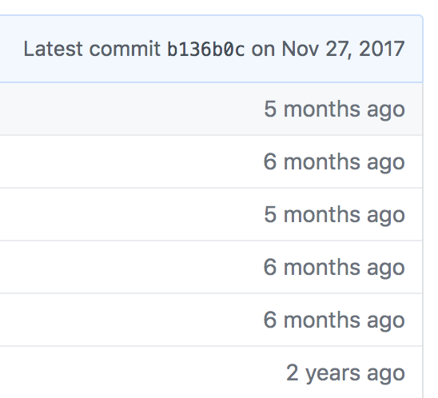
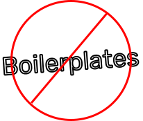
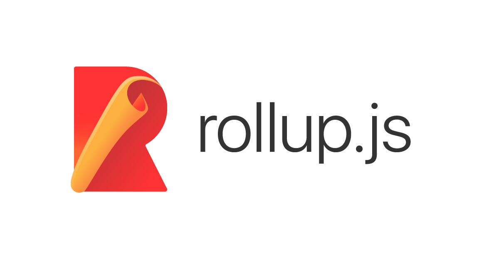

import { Split, Horizontal } from 'mdx-deck/layouts'
import { Image, Appear } from 'mdx-deck'
import Cover from './components/Cover'
import Avatar from './components/Avatar'
export { default as theme} from './theme'
import { Notes } from 'mdx-deck'

<Cover>

## Create *reusable* toolkits

</Cover>

---

### Be *honest*

---

How many of you copied your last project, to serve as the basis for 
your new project?
<Notes>
  How many of you, by show of hands?
  We'd never consider copy & pasting in day to day web development.
  Using a boilerplate is a similar notion, in an abstract way
</Notes>

--- 

Functions? Variables? Nah.

<Notes>I'll just repeat this logic in 7 different places. "I like typing it again"</Notes>

---

Next Question:
<Notes>Ready?</Notes>

---

How many of you have a boilerplate that became stale, never to be used or worked on again?

---



---

<Image src="images/danabramov.png" size="contain" />

---

<Image src="images/reusable-toolkits.png" size="contain" />

---



---

<Notes>How many of you, by show of hands?</Notes>


**Solutions**

Problems:

I setup Typescript / Prettier / Jest for my application... I don't want to have to set it up again.
Usual answer: boilerplate (or just copy and paste into another repo)
Problem with this: Boilerplates are versioned, but are usually a one time shot. They're helpful for spinning up a new repo (which is questionable)
but even then, after this new repo is created, you will have diverged too far to benefit from any updates to the original boilerplate.

Show of hands: how many of you have developed a boilerplate, or seen a boilerplate get developed, and fall out of use, and get stale?

Problem: I have more than one repo with Storybook / Typescript / Jest / etc configured. I have them configured all the same for the most part.
How do I create a situation where I can keep all these repo's in sync?

2 Answer: "We'll get around to it" or "Number of repos = number of PR's". 

<Notes>
  What usually ends up happening, is the "main" repos that are the most worked on, usually get the new updates, and the older repos
  aren't priority, they aren't apart of your direct teams responsibility, they fall behind, and then there needs to be a business
  case made to update these repos. Either that, or your the person who goes through and makes this adjustment to every repo, making
  multiple PR's. Let's not even talk about the situation where you get 2 approved and merge, and then the 4 remaining don't pass a
  build.
</Notes>

Problem: Another team wants to hear about our best practices that we've setup. Things like linting, prettier configuration, 
tslint configuration, storybook configuration. I can walk them through it, but I've already went through the hassle of
configuration, so that they don't have to. Is there an efficient way to communicate these Things

Answer: Create a boilerplate / fork react scripts.

One thing I've noticed in companies, is, as time goes on, we generally desire standardization. So if a majority of our teams use Typescript,
we generally find a lot of value in keeping that link going, and trying to dissuade another team by using flow. It results in less education, 
etc.

Problem: even if I give these other teams (or the outside world this solution), because it's just a boilerplate, same rules apply: if they
already have a project in flight, it has minimal value, and once they create the repo based on that bootstrap, if the initial bootstrap project
evolves, they have no way of pulling down those changes:

Solution: ?


https://kentcdodds.com/blog/concerning-toolkits
kcd-scripts

---

https://github.com/reyronald/awesome-toolkits

Create React App
Angular CLI
Ember CLI
Parcel
Next.js
Gatsby

---

Let's create a boilerplate!

<Notes>Only visible in presenter mode</Notes>

---




```jsx
<CodeSnippet />
```

---

import Demo from './components/Demo'

## <Demo />

# The end